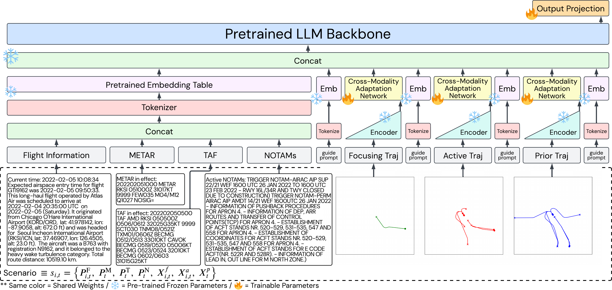
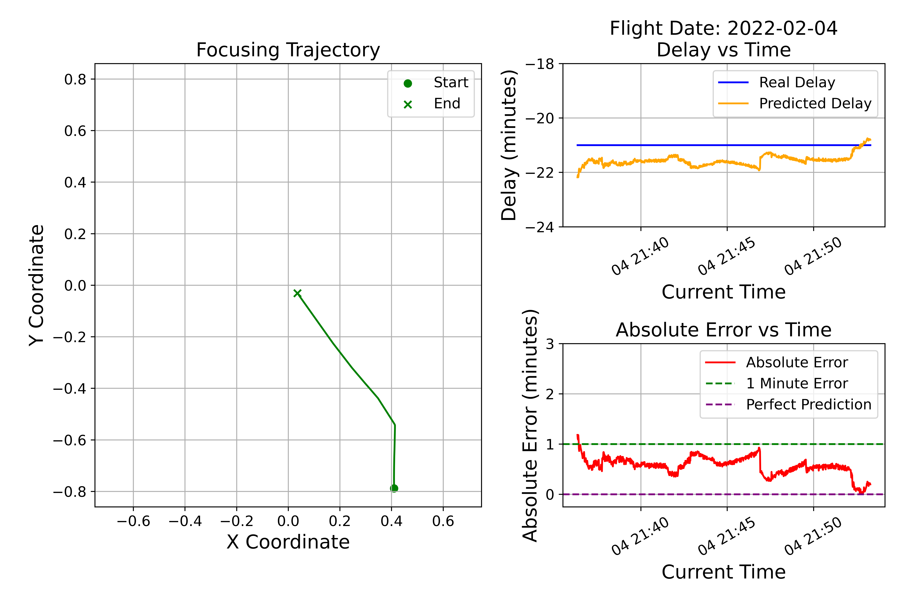

# LLM4Delay: Flight Delay Prediction via Cross-Modality Adaptation of Large Language Models and Aircraft Trajectory Representation



A public implementation of LLM4Delay, a multimodal framework for arrival delay prediction that integrates aeronautical text via a pretrained LLM with instance-level trajectory representations adapted through a cross-modality technique. This repository contains the official implementation for the LLM4Delay framework as described in the paper titled "LLM4Delay: Flight Delay Prediction via Cross-Modality Adaptation of Large Language Models and Aircraft Trajectory Representation."

## Requirements

The recommended requirements for LLM4Delay are listed as follows:
* python=3.11.8
* accelerate=1.6.0
* datasets=2.18.0
* huggingface-hub=0.31.1
* matplotlib=3.8.2
* numpy=1.26.4
* pandas=2.1.4
* python-metar=1.4.0
* scikit-learn=1.4.1.post1
* torch=2.7.0
* tqdm=4.67.1
* transformer=4.67.1
* wandb=0.16.4

The dependencies can be installed by:
```bash
pip install -r requirements.txt
```

## Dataset
The code implementation uses the ICNDelay dataset available via [ICNDelay](https://huggingface.co/datasets/petchthwr/ICNDelay). This dataset provides a monthly collection of multimodal inputs with flight delay regression labels. LLM4Delay integrates flight, weather, and NOTAM prompts, along with three trajectory types (focusing, active, and prior) to predict delay by estimating post-terminal duration.

## Experiments

The experimental setup and training pipeline are implemented in `experiment.py`. To reproduce the results, run:
```bash
python experiment.py
```
## Model Demonstration



## Setup: API Tokens

This project requires a **Hugging Face token** and a **Weights & Biases token**.

### Hugging Face Token

1. Sign up at [huggingface.co](https://huggingface.co/join).
2. Generate a token at [huggingface.co/settings/tokens](https://huggingface.co/settings/tokens) (Read access is sufficient for downloading models).
**Gated models** (e.g., Llama) require you to visit the model page on Hugging Face and submit an access request form before you can download them with your token. Approval is usually quick but not instant.

### Weights & Biases Token

1. Sign up at [wandb.ai](https://wandb.ai/site).
2. Copy your API key from [wandb.ai/authorize](https://wandb.ai/authorize).

## Citation

```bibtex
@dataset{ICNDelay2026,
  title={ICNDelay: Multimodal Language–Time-Series Flight Delay Regression Dataset for Incheon International Airport},
  author={Phisannupawong, Thaweerath and Damanik, Joshua Julian and Choi, Han-Lim},
  year={2026},
  note={https://huggingface.co/datasets/petchthwr/ICNDelay}
}

@misc{LLM4Delay2025,
  title={Flight Delay Prediction via Cross-Modality Adaptation of Large Language Models and Aircraft Trajectory Representation}, 
  author={Phisannupawong, Thaweerath and Damanik, Joshua Julian and Choi, Han-Lim},
  year={2025},
  eprint={2510.23636},
  archivePrefix={arXiv},
  primaryClass={cs.LG},
  url={https://arxiv.org/abs/2510.23636}, 
}
```


